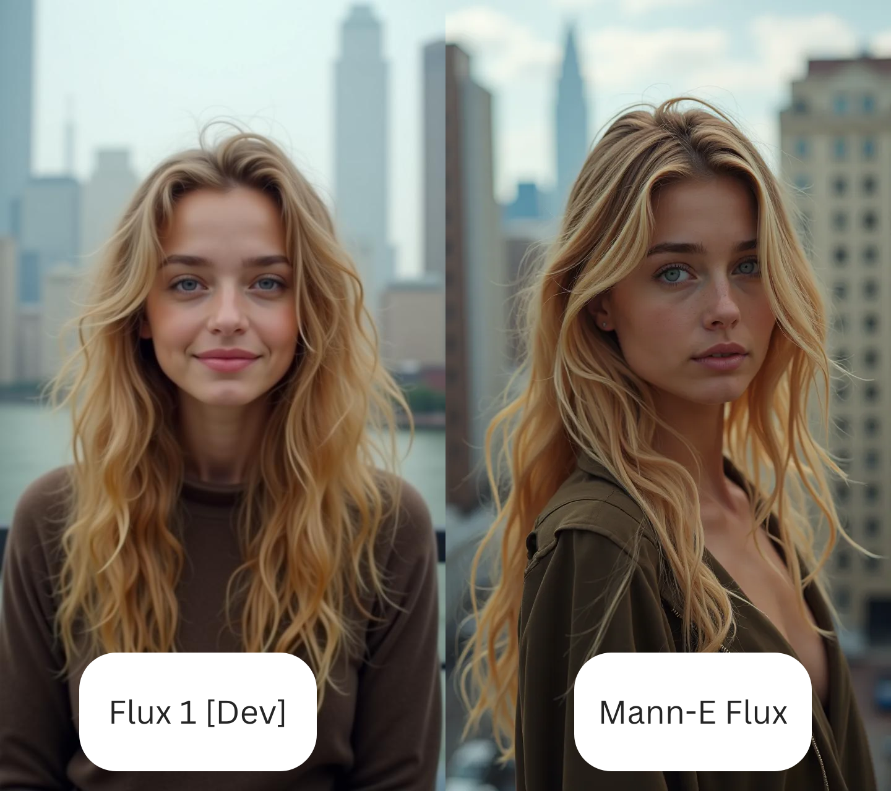
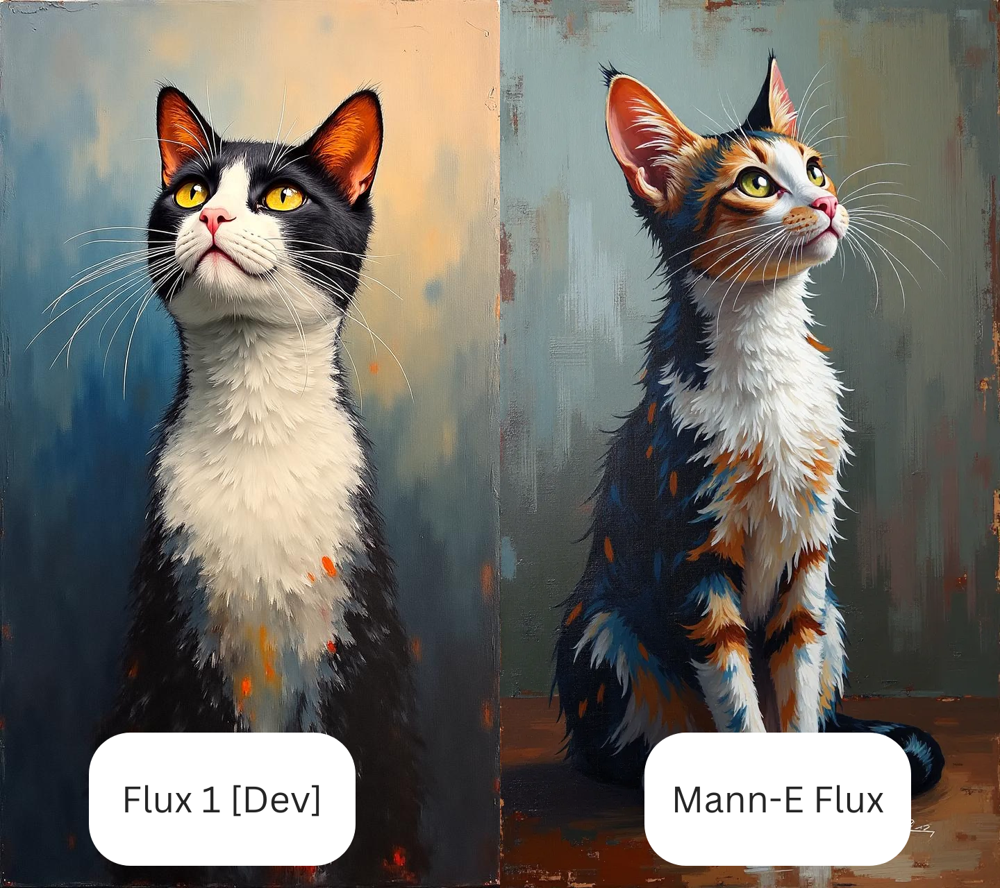

# Mann-E Flux : The last AI image model you'll test

In the past few months, FLUX models became a trend on the internet and specially the AI community. We, at Mann-E, tried to develop FLUX-inspired models (with similar architecture) and this repository is for tools and codes related to the Mann-E Flux model. 

This model, follows the same architecture as flux and can be used with diffusers and we currently use it in our private systems. Thanks to [RunPod](https://runpod.io) we managed to make this model in less than 48 hours on A100 and H100 GPU's!

    

## Versions

There will be three versions available. Two of them will be completely proprietary and one will be published under _[MPSL](https://github.com/mann-e/mpsl)_ license.

1. Quality 
2. Anime 
3. Flux 

### Difference Between Proprietary (Quality/Anime) and Flux versions

_Quality_ and _Anime_ versions are a little older than Flux version actually, but since we adopted the new architecture, we decided to rebuild these models to have a more unified infrastructure in our hands. Also it is important to note that both of these models are made to support some midjourney-like behavior (such as `--sref` or other flags you're using with midjourney.) and the flux version, is not like that. 

### Outputs of three models

    

> From left to right Flux, Quality and Anime

## Characteristics of The Model

The model is mostly like your regular FLUX-1[Dev] model, with these differences: 

1. The images used in training, like our _Mann-E Dreams_ model, are from midjourney. So you will have a more "Midjourney like" feel using this model. 
2. The model does the inference in only 8-10 steps (exactly like our Dreams model, we're manouvering on our speed!)

## Comparison with FLUX-1[Dev]

In the photo above, we used the same prompt with both models and you can see the output. And now what about something a little more artistic? 

In the photo above, we tried to make an expressionist painting with both models. 

## Release Date 

There will be an initial release in the end of November this year. 

## Community 

* [Website](https://mann-e.com)
* [Discord](https://discord.gg/7UBd7J36B4)
* [Personal blog of Muhammadreza Haghiri](https://haghiri75.com/en)